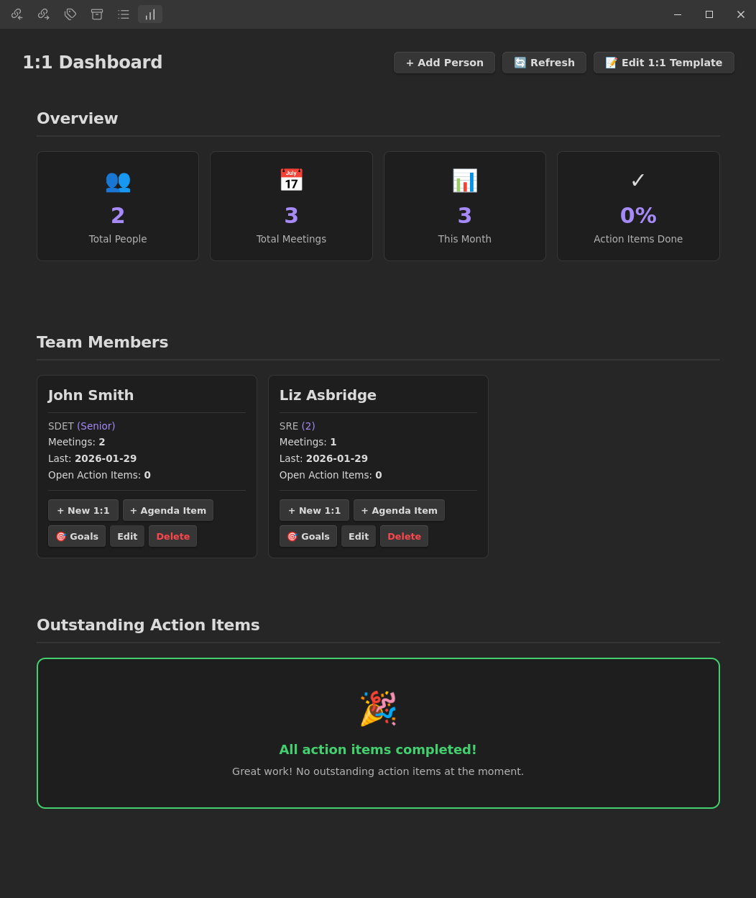
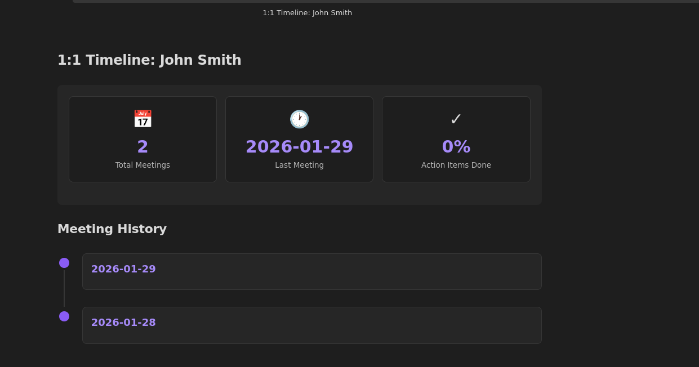
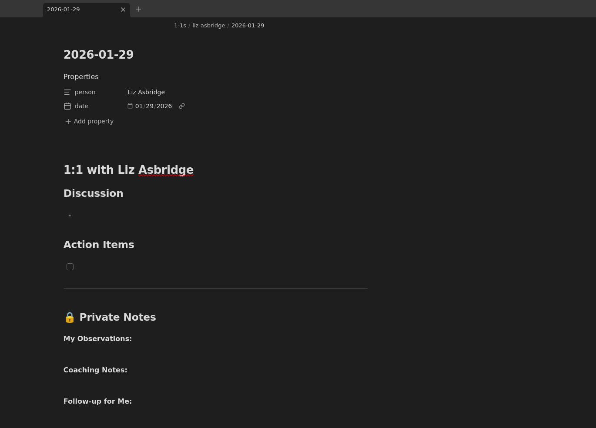
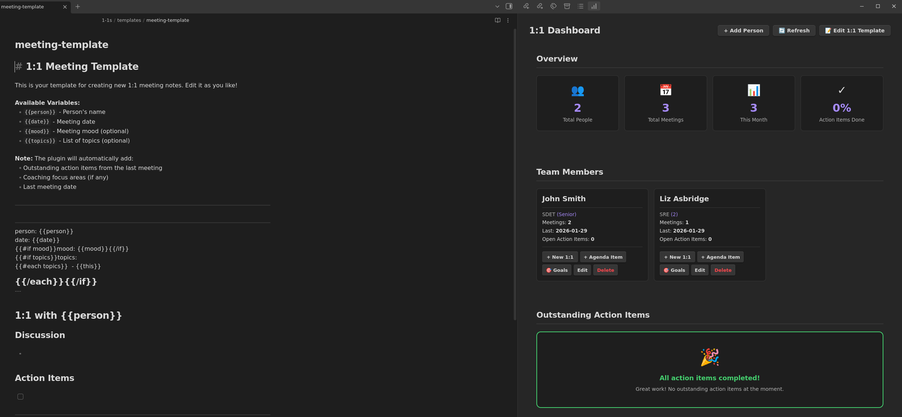
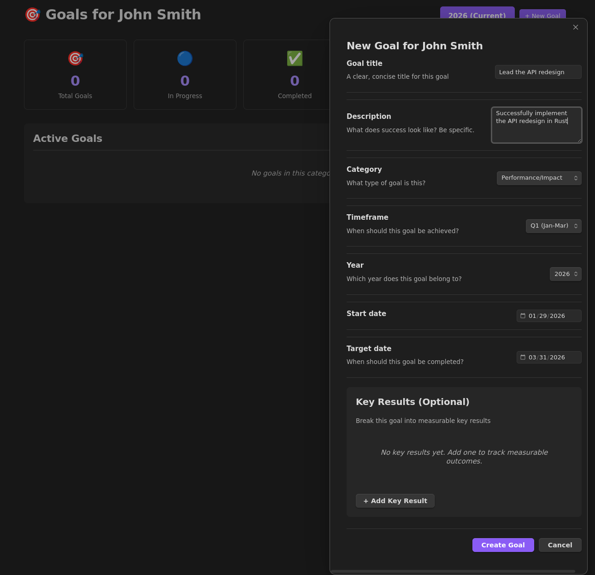
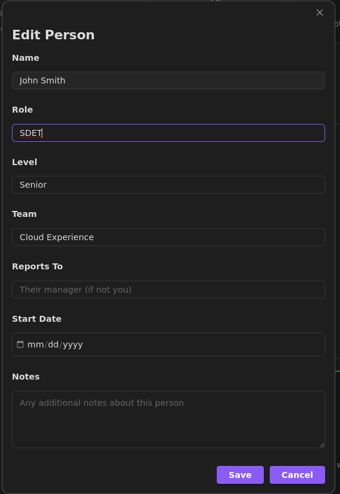

# 1:1 Manager

This is a plugin for managing your one-on-one meetings in Obsidian. If you're a manager (or direct report, or anyone who has regular check-ins with people), this gives you a place to keep notes, track what you talked about, and remember what you actually need to do.

## Why this exists

It makes 1:1 notes and reminders much easier. With the push of a button you can start taking 1:1 notes with a customizable template. Track the goals of your reports to help them meet their targets and never forget action items stemming from 1:1s again. It also helps organize your 1:1 notes cleanly!

## What it does

### Dashboard



The Dashboard is an Obsidian side-panel that is the main interaction spot of this plugin. Here you can add Agenda items as a reminder to discuss later, start a new 1:1 note session that uses a customizable template, enter in your reports goals, etc.

Click on someone's card to see all your meetings with them in chronological order.



### Meeting notes

When you create a 1:1 note, you get a structured template with sections for discussion points and action items.



This is 100% easily customizable too with a click of a button. Do whatever cool templating you can imagine.



### Goals tracking

Each person can have goals attached to them. You can track progress, add check-ins, note blockers. It's useful for performance review season or just keeping tabs on what people are working toward.



### People management

Add profiles for your direct reports (or whoever you meet with regularly). Track their role, level, team, start date. You can edit or delete people from the dashboard.



## Setup

You'll need Obsidian v0.15.0+ and Node.js v16+ to build this. Eventually it might be in the community plugin repository.

1. Clone or download this repo into your vault's plugins folder:
   - Windows: `<YourVault>\.obsidian\plugins\one-on-one-manager`
   - Mac/Linux: `<YourVault>/.obsidian/plugins/one-on-one-manager`

2. Install and build:
   ```bash
   cd one-on-one-manager
   npm install
   npm run build
   ```

3. Enable the plugin in Obsidian:
   - Settings → Community plugins
   - Turn off Safe mode if it's on
   - Find "1:1 Manager" and toggle it on

For development, run `npm run dev` to auto-rebuild on changes. You'll still need to reload Obsidian (Ctrl/Cmd+R) to see updates.
